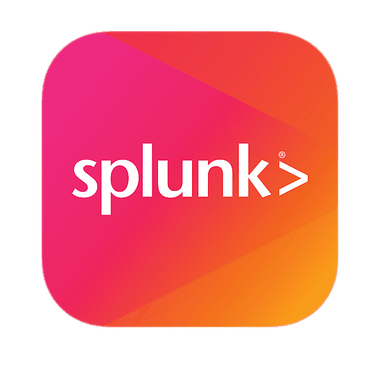
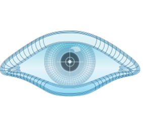

## Hi, there. I'm Nawab 👋
**`CyberSecurity Analyst (SOC/IR/VAPT)`**

**A SOC Analyst by profession and a Penetration Tester by passion.**

I have 2.5+ years of hands-on experience working in enterprise SOC environments, responding to incidents, and improving detection capabilities using SIEM and EDR platforms. Beyond my day-to-day role, I actively explore offensive security through hands-on labs and attack simulations to better understand adversary techniques and strengthen defensive response.

## ⚙️ Tech Stack

## 🛡️ Security Stack

  
  
  
  
  
  
  
  
  

## 🎯 Current Focus
- Incident Response & Threat Investigation  
- Detection Engineering.  
- Security Automation & Playbook creation.    

## 📫 Let’s Connect
- LinkedIn: https://linkedin.com/in/sherif7  
- Email: sherif07@protonmail.com  

💡 Always learning.
